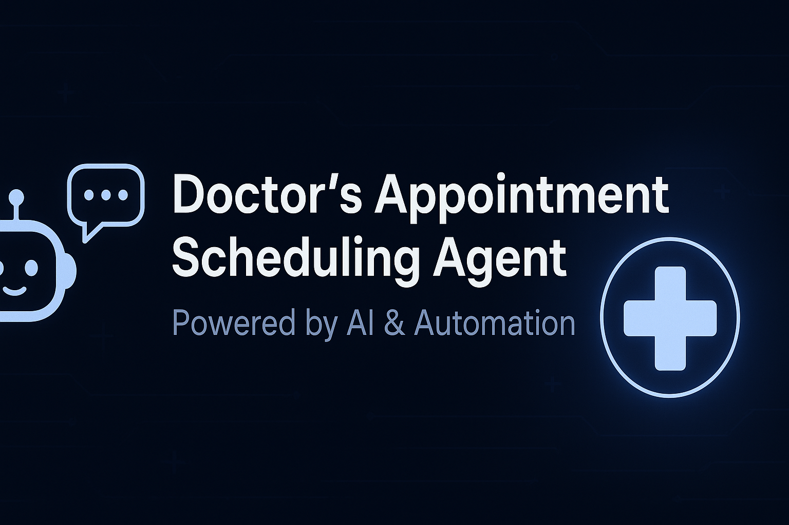

<p align="center">
  
</p>

# 🏥 Doctor’s Appointment Scheduling Agent

[](https://www.python.org/)
[](https://fastapi.tiangolo.com/)
[](LICENSE)
[](https://azure.microsoft.com/)
[]()

> An intelligent, conversation-driven system that allows patients to **book, manage, or cancel doctor appointments** through a natural chat experience.  
> Built with Python ⚙️, FastAPI ⚡, LangGraph 🧩, and backed by a relational database for real-world scalability.

---

## ✨ Overview

The **Doctor’s Appointment Scheduling Agent** automates appointment scheduling through **natural dialogue**.  
Patients can simply talk to the agent — e.g.,

> “I’d like to book an appointment with a dermatologist tomorrow.”

The agent understands the intent, fetches available doctors, retrieves open slots, validates patient info, and confirms the booking — all autonomously.

---

## 🧠 Core Features

| Feature | Description |
|----------|-------------|
| 🧾 **Patient Identification** | Detects if the patient is new or returning. Validates returning patients by name & DOB; registers new patients with demographic + insurance info. |
| 👩‍⚕️ **Doctor Discovery** | Finds doctors based on specialization, preferred name, or previous visits. |
| ⏰ **Slot Management** | Retrieves available slots and marks them booked upon confirmation. |
| 📅 **Appointment Booking** | Creates new appointments and maintains booking state in the database. |
| ❌ **Appointment Cancellation** | Allows patients to cancel upcoming appointments. |
| 💬 **Context-Aware Dialogue** | Keeps memory across turns to manage natural, continuous chat flow. |
| 🧱 **Robust Error Handling** | Manages invalid inputs, unavailable slots, or mismatched patient data gracefully. |

---

## 🏗️ System Architecture

```
                ┌─────────────────────┐
                │  Conversation Agent │
                │   (LLM + Memory)    │
                └─────────┬───────────┘
                          │
            ┌─────────────┼──────────────┐
            │                            │
 ┌──────────────────┐        ┌────────────────────┐
 │   State Manager   │        │     Tool Graph     │
 │ (Conversation, DB │        │ (Executes tool     │
 │   Memory Sync)    │        │  calls in sequence)│
 └──────────────────┘        └────────────────────┘
            │                            │
            │                            │
    ┌──────────────┐            ┌────────────────────────┐
    │   Tools API  │            │  Database (ClinicAPT)   │
    │(Patient,Slot │            │ (Doctors, Slots, Appts) │
    │   Booking)   │            └────────────────────────┘
    └──────────────┘
```


### 🔑 Key Modules
- **`agent/`** → Controls reasoning, conversation logic, and state.
- **`state/`** → Handles contextual variables across the conversation.
- **`tools/`** → Encapsulates backend logic like finding patients, booking appointments, etc.
- **`database/`** → Defines schema and handles SQL interactions.
- **`apis/routes/`** → FastAPI routes exposing RESTful endpoints.

---

## 🗂️ Database Schema

### Tables
- **Doctor** — Doctor details (ID, name, specialization)
- **Patient** — Patient details (ID, name, DOB, phone, insurance info)
- **DoctorSlot** — Slot timing info (`SlotDate`, `SlotStartTime`, `SlotEndTime`, `IsBooked`)
- **Appointment** — Links Patient ↔ DoctorSlot with status

### Example SQL Insert
```sql
INSERT INTO clinicapt.DoctorSlot (DoctorID, SlotDate, SlotStartTime, SlotEndTime, IsBooked)
VALUES
(1, '2025-11-01', '09:00', '09:30', FALSE),
(1, '2025-11-01', '09:30', '10:00', FALSE);
````

---

## ⚙️ Tech Stack

| Layer                | Technology                          |
| -------------------- | ----------------------------------- |
| **Language**         | Python 3.10+                        |
| **Framework**        | FastAPI / LangGraph                 |
| **Database**         | PostgreSQL / SQL Server             |
| **LLM**              | OpenAI GPT / Google Gemini          |
| **State Management** | Custom Pydantic-based state tracker |
| **Deployment**       | Azure Web App (Linux)               |
| **Auth**             | OAuth 2.0-ready architecture        |

---

## 💬 Example Conversation

**Agent:** Hi there! Are you a new or returning patient?
**User:** I’m a returning patient.
**Agent:** Great! Please share your last name and date of birth.
**User:** Anand, 02/10/1998.
**Agent:** Thanks, Amitabh! Would you like to see Dr. Mehra again?
**User:** Yes, tomorrow morning.
**Agent:** Dr. Mehra has a 10:00–10:30 AM slot. Should I book it?
**User:** Yes, please.
**Agent:** ✅ Appointment confirmed for **Nov 5th, 2025 at 10:00 AM**.

---

## 🧰 Tool Summary

| Tool                        | Description                                 |
| --------------------------- | ------------------------------------------- |
| `find_patient`              | Looks up an existing patient by name + DOB. |
| `create_patient`            | Registers a new patient record.             |
| `get_doctors_by_speciality` | Lists doctors matching a specialization.    |
| `get_available_slots`       | Returns available time slots.               |
| `book_appointment`          | Books appointment and updates slot.         |
| `cancel_appointment`        | Cancels an existing appointment.            |

---

## 🚀 Getting Started

### 1️⃣ Clone the Repository

```bash
git clone https://github.com/yourusername/doctor-appointment-agent.git
cd doctor-appointment-agent
```

### 2️⃣ Create Virtual Environment

```bash
python -m venv .venv
source .venv/bin/activate  # Linux/macOS
.venv\Scripts\activate     # Windows
```

### 3️⃣ Install Dependencies

```bash
pip install -r requirements.txt
```

### 4️⃣ Set Environment Variables

Create a `.env` file in the root:

```
DB_CONNECTION_STRING=your_database_connection_string
OPENAI_API_KEY=your_api_key
AZURE_APP_CONFIG=...
```

### 5️⃣ Run the App

```bash
python app.py
```

Access API at `http://localhost:8000`.

---

## 🧪 Testing the Agent

Use Postman or curl:

```bash
POST /chat
{
  "message": "Book a cardiologist appointment for tomorrow"
}
```

The agent will respond with the available slots and proceed to booking.

---

## 📊 Future Enhancements

* 📅 Integration with Google / Outlook Calendar
* 🎙️ Voice-based interface
* 📈 Admin dashboard for appointments overview
* 🔔 SMS / email reminders
* 🩺 Multi-clinic support

---

## 🧑‍💻 Author

**Amitabh Anand**
Software Engineer • Azure Certified Developer • Backend & AI Solutions Expert

📧 [LinkedIn](https://linkedin.com/in/amitabhanand04)
🌐 [Portfolio](https://amitabhanand04.github.io)

---

## 🪪 License

This project is licensed under the [MIT License](LICENSE).

---

### ❤️ Support & Contributions

Contributions are welcome!
If you’d like to enhance the agent or extend its capabilities, feel free to:

```bash
fork → improve → pull request ✅
```

---


